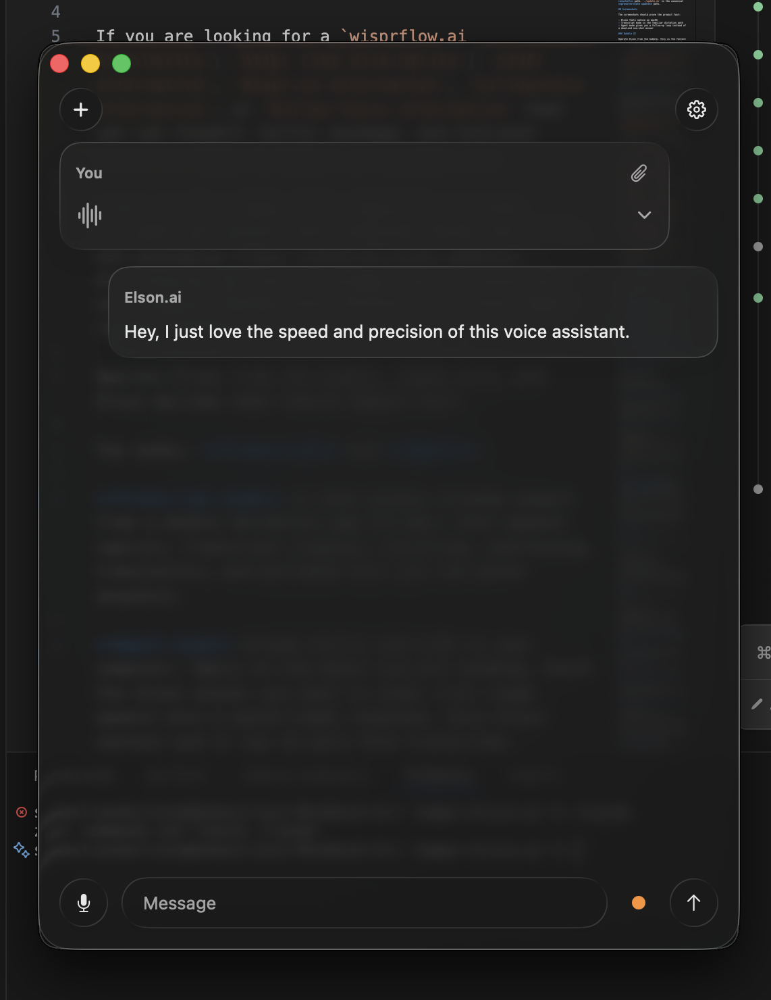
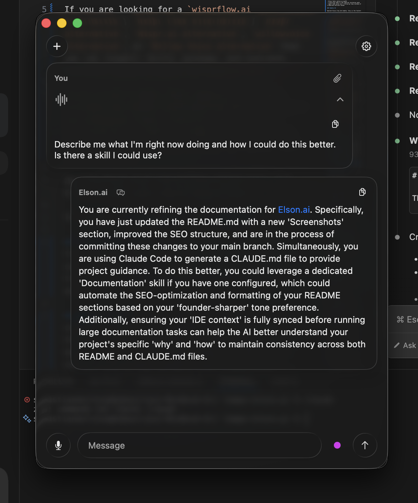
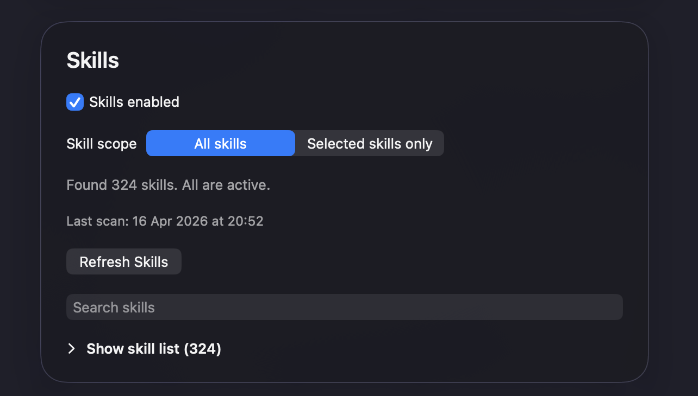
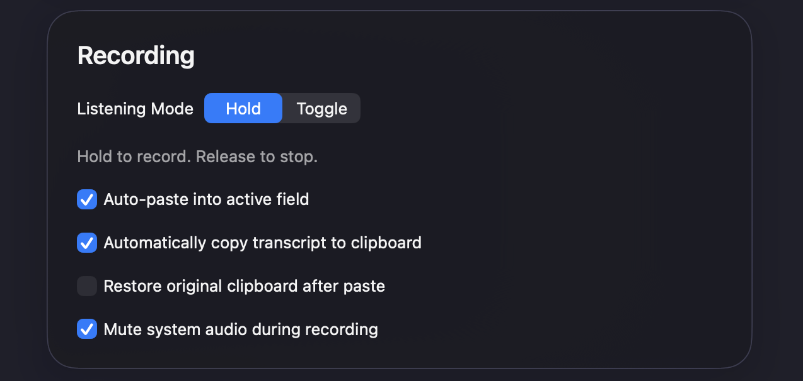
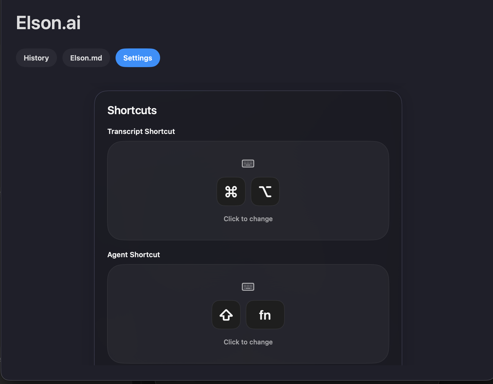
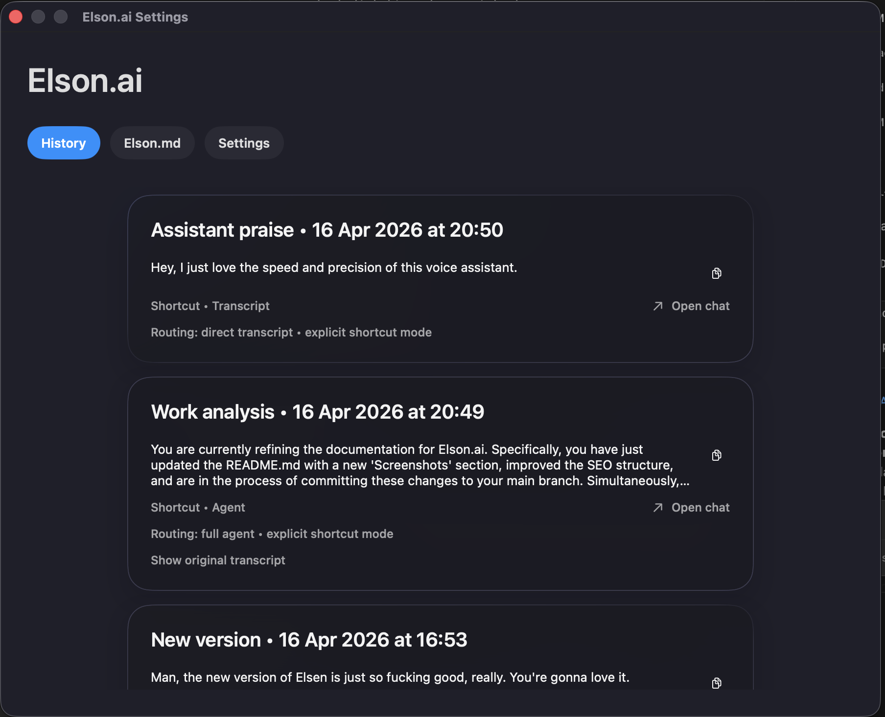
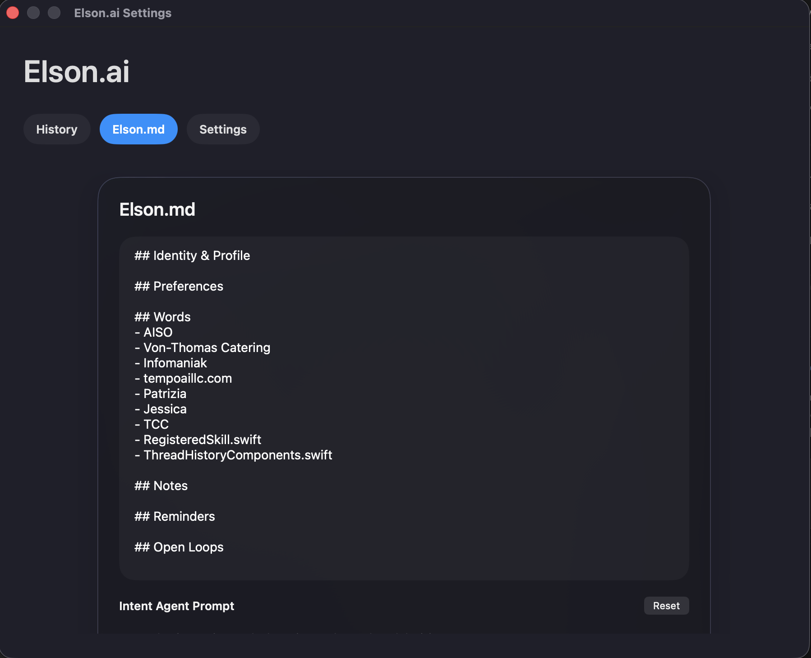

# Elson.AI

Open-source Wispr Flow alternative for macOS.

Elson is a local-first macOS voice assistant for ultra-fast dictation, transcript cleanup, screenshot-aware replies, and paste-first desktop workflows.

If you are looking for an open-source alternative to **Wispr Flow**, **Wispr.ai**, or **Willow Voice** that you can actually inspect, build, run, and customize, Elson is built for exactly that.

<b>Paste this into `Claude`, `Codex`, or any other local agent and enjoy Elson.ai.</b>

## Install

```bash
curl -fsSL https://raw.githubusercontent.com/TEMPO-AI-LLC/elson.ai/main/github-install.sh | bash
```

## Update

```bash
curl -fsSL https://raw.githubusercontent.com/TEMPO-AI-LLC/elson.ai/main/github-install.sh | bash -s -- --preserve-state
```

Works on macOS 15+.
The installer picks the right build for your Mac, installs the app, and opens it.

---

Native Swift/SwiftUI app. Build flows, packaging, prompts, screenshots, and evals all live in this repo.

Two modes. **Transcript** and **Agent**.

**Transcript mode** is the core dictation path, just much faster: raw speech goes through **Groq** for transcription, then through the **Cerebras** transcript path for cleanup and polish. The result is extremely fast voice-to-text, rewriting, shortening, translation, and polished text you can paste anywhere.

**Agent mode** turns Elson into more than a transcription app. Reply to the email you are reading. Draft the Slack answer you want to send. Turn rough speech into a paste-ready response. Give Elson context and it can do more than transcribe.

If Elson makes a mistake, follow up in chat, leave feedback, tweak the prompt, and keep going. The repo includes a built-in eval pipeline because this product is meant to improve with measurement.

Elson can also use skills. Skills are a real product surface the app can discover, load, and use.


> **Truth rail**
>
> - Elson is a native macOS app written in Swift and SwiftUI.
> - The code ships under **Apache 2.0 + Common Clause**.
> - Elson keeps app state locally, but it is **not a fully offline app**. Transcription and agent flows use external model providers.
> - The checked-in build system currently supports two macOS targets: `compat15` for macOS 15+ and `modern` for macOS 26+.
> - `./build.sh` is the canonical **full reset + reinstall** path. `./update.sh` is the canonical **preserve-state update** path.

## Screenshots

These screenshots should prove the product fast: ultra-fast transcript mode, real agent workflows, and actual settings, memory, and history surfaces inside the app.

### Transcript mode: absurdly fast dictation and cleanup

This is the screenshot that should sell the transcript path. Elson is not trying to be another slow, mushy dictation layer. Transcript mode is optimized around speed and stability: **Groq handles the raw speech-to-text step, then the Cerebras transcript path cleans it up into paste-ready text** fast enough that the whole flow feels immediate.

<p align="center">
  
</p>

<p align="center">
  <sub>Groq for transcription, Cerebras for transcript cleanup, and a voice-to-text flow that feels instant instead of sluggish.</sub>
</p>

### Agent mode: more than transcription

This is where Elson stops being “just dictation”. Agent mode can look at what you are doing, use context, and generate a real answer you can use. Reply to an email. Draft a Slack response. Ask what you are doing and how to do it better. Give it context and it does more than transcribe.

<p align="center">
  
</p>

<p align="center">
  <sub>Agent mode turns Elson from a dictation tool into a desktop assistant that can actually respond to what is on your screen.</sub>
</p>

### Follow-up chat and feedback loop

The follow-up loop matters because Elson is not “speak once and pray.” If it gets something wrong, you follow up in chat, correct it, and keep going. That is a much better product loop than one-shot transcription with no iteration.

<p align="center">
  
</p>

<p align="center">
  <sub>Follow up, refine the result, and keep the interaction going instead of starting from zero every time.</sub>
</p>

### Skills: connect Elson to real workflows

The Skills view proves that Elson is not a fake “AI can do everything” wrapper. Skills are a real product surface. You can enable them, scan them, scope them, search them, and decide how broad the assistant should operate.

That matters for Agent mode because it turns Elson into a voice interface for actual tools and workflows, not just a prettier chat box.

<p align="center">
  
</p>

<p align="center">
  <sub>Skills are configurable, discoverable, and scoped inside the product instead of being hand-wavy marketing promises.</sub>
</p>

### Recording and shortcuts: built for speed, not ceremony

The recording and shortcut settings show the actual desktop workflow philosophy: hold to record, release to stop, auto-paste into the active field, optional clipboard copy, optional clipboard restore, and separate shortcuts for transcript and agent actions.

This is one of the strongest reasons Elson feels like a real macOS product instead of a hosted AI product trying to cosplay as one.

<p align="center">
  
</p>

<p align="center">
  <sub>Transcript mode is optimized for speed: hold to record, release to stop, and optionally auto-paste the cleaned result immediately.</sub>
</p>

<p align="center">
  
</p>

<p align="center">
  <sub>Separate shortcuts for transcript and agent paths make the product feel immediate instead of modal and clumsy.</sub>
</p>

### History: your outputs are not disposable

The History view proves the output is not disposable. Transcript runs and agent runs are saved locally, can be reopened, and can be continued. That matters if you want a real Wispr Flow alternative or Willow Voice alternative instead of a one-shot voice box with no memory.


<p align="center">
  
</p>
<p align="center">
  <sub>Local history makes outputs reusable, reviewable, and easy to continue instead of disappearing after one interaction.</sub>
</p>

### Elson.md memory: customization and persistence

The Elson.md screen shows one of the most important product ideas in the app: persistent local memory and customisation. You can keep profile data, preferences, important words, notes, reminders, and open loops in a place the assistant can use.

This is part of why Elson feels personal and configurable rather than fixed and closed.

<p align="center">
  
</p>

<p align="center">
  <sub>Elson.md gives the assistant persistent local memory instead of forcing you to repeat the same context over and over.</sub>
</p>

## Table of Contents

- [Screenshots](#screenshots)
- [Why Elson exists](#why-elson-exists)
- [What is in this repository today](#what-is-in-this-repository-today)
- [Who Elson is for](#who-elson-is-for)
- [Product modes](#product-modes)
- [Core user-facing features](#core-user-facing-features)
- [Why people evaluate Elson as a Wispr Flow or Willow Voice alternative](#why-people-evaluate-elson-as-a-wispr-flow-or-willow-voice-alternative)
- [Roadmap](#roadmap)
- [For builders and maintainers](#for-builders-and-maintainers)
- [Quick start](#quick-start)
- [Build, install, update, and rebuild semantics](#build-install-update-and-rebuild-semantics)
- [Build variants and packaging artifacts](#build-variants-and-packaging-artifacts)
- [Distribution and friend-shareable installer flows](#distribution-and-friend-shareable-installer-flows)
- [Configuration and local development](#configuration-and-local-development)
- [Permissions and macOS privacy model](#permissions-and-macos-privacy-model)
- [Runtime, providers, prompts, and memory](#runtime-providers-prompts-and-memory)
- [Evals and prompt iteration](#evals-and-prompt-iteration)
- [Architecture overview](#architecture-overview)
- [Repo map](#repo-map)
- [Local state, logs, and important file paths](#local-state-logs-and-important-file-paths)
- [FAQ](#faq)
- [License](#license)
- [Contributing and repo-specific rules](#contributing-and-repo-specific-rules)

## Why Elson exists

Most voice products for Mac optimize for one narrow slice of the workflow:

- dictation only
- polished transcript cleanup only
- browser- or cloud-centric assistant behavior
- autopilot-style actions that hide too much state

Elson takes a different approach:

- **Native desktop first**: it is a Swift/SwiftUI app, not a thin wrapper around a web product.
- **Transcript and agent both matter**: some voice input should become polished user-authored text, and some voice input should become an answer or local assistant action.
- **Local state matters**: thread history, prompts, config, logs, and memory live on your machine.
- **Control matters**: Elson is explicitly paste-first. It does not auto-send messages for you.
- **Buildability matters**: the public repo includes the app, scripts, packaging flows, and eval tooling, not just marketing pages.

That combination is why people searching for a **macOS voice assistant**, **AI transcription app for Mac**, **local-first dictation app**, **Wispr Flow alternative**, or **Willow Voice alternative** often mean something close to what Elson is trying to be.

## What is in this repository today

This repo already contains three substantial layers:

### 1. The native macOS app

- Swift 6.2 / SwiftUI application
- menu bar app surface
- settings UI
- chat / thread history UI
- floating bubble / indicator UI
- onboarding and permissions flow
- transcript and agent execution paths

### 2. Build, install, update, and packaging flows

- reproducible local builds through Swift Package Manager
- variant-aware app bundling and DMG generation
- full reinstall flow with TCC reset
- preserve-state update flow
- universal installer ZIP for sharing builds with other users
- local artifact install support and remote artifact install support

### 3. Public eval and prompt-iteration tooling

- Python package under [`evals_python`](./evals_python)
- fixture harvesting
- Intent Agent replay runs
- JSON / CSV / Markdown reporting
- shared prompt source of truth through [`Elson/Resources/prompt-config.json`](./Elson/Resources/prompt-config.json)

The public repo intentionally does **not** include private fixture bundles, replay history, or transcript-derived review artifacts from private usage.

## Who Elson is for

Elson is a fit if you want some combination of:

- a native **voice assistant for macOS**
- a **dictation app for Mac** that can clean up rough speech into business-ready text
- a **Wispr.ai alternative** with more visible local state and repo-level inspectability
- a **Willow Voice alternative** that combines dictation, screenshot context, and assistant-style replies
- an open-source alternative searchers can discover and a codebase you can actually run, inspect, and adapt instead of relying on a closed hosted workflow

It is especially aimed at people who already live in desktop apps and want voice input to slot into their existing paste-and-edit workflow instead of forcing them into a new destination product.

## Product modes

Elson revolves around two primary modes.

### Transcript mode

Transcript mode is for text you still own as the author.

Use it when you want Elson to:

- clean up raw speech
- resolve self-corrections
- shorten or simplify dictated text
- translate
- rewrite with explicit instructions
- remove or reshape sentences
- turn rough spoken notes into cleaner writing without changing the fact that it is still your text

In the checked-in codebase, Transcript mode is the direct path for transcript cleanup and structured text polishing.

### Agent mode

Agent mode is for answer-first or action-first behavior.

Use it when you want Elson to:

- reply to a question
- interpret current context from screenshot, clipboard, and thread state
- create or update local notes / reminders / MyElson memory
- produce a paste-ready assistant response
- trigger limited local desktop actions

Agent mode is still intentionally conservative. Elson is designed around **explicit user control** and **paste-first outcomes**, not silent autonomous sending.

### Per-thread behavior

The app stores thread-level state and supports Transcript / Agent behavior within the chat experience, so the conversation surface is not just a disposable prompt box.

## Core user-facing features

These are the major user-facing capabilities currently represented in the code and scripts in this repo.

### 1. Global voice capture for desktop workflows

- global recording shortcuts
- configurable listening modes: `hold` or `toggle`
- separate transcript and agent shortcuts
- menu bar presence and floating bubble / indicator state
- optional launch at login

### 2. Paste-first dictation and transcript cleanup

- raw speech capture
- transcript cleanup
- optional automatic clipboard copy
- optional auto-paste into the active field
- optional restore of the original clipboard after paste
- optional muting of system audio during recording

This is a key product difference: Elson is designed to work with the apps you already use, rather than forcing you into a proprietary editor.

### 3. Screenshot-aware assistance

- screen recording permission support
- screenshot capture through `ScreenCaptureKit`
- screenshot JPEG processing
- screenshot-aware replies in agent flows
- troubleshooting and debug messaging for screenshot failures

This is part of why Elson is more than a plain dictation tool. It can reason about the desktop context around your request, not just the spoken words.

### 4. Clipboard and frontmost-app awareness

- clipboard capture as context
- clipboard delivery of final output
- frontmost-app resolution
- local desktop action execution

The strongest built-in local action remains **paste into the active field**, which keeps the tool predictable and user-controlled.

### 5. Threaded chat, history, and review surfaces

- persistent chat threads saved locally
- thread history window
- transcript history in settings
- assistant message rendering with Markdown
- attachment handling in messages
- route-aware feedback capture inside thread UI

### 6. Feedback capture and prompt learning

The repo does not stop at “collect feedback.”

It includes:

- feedback logging
- route overrides for feedback
- prompt-learning flow that can update transcript or working-agent prompts
- status tracking for prompt-learning results

When configured, feedback can be used to refine how Elson behaves over time.

### 7. MyElson memory and workspace-aware files

Elson maintains a persistent user memory layer called **MyElson**.

The repo supports:

- local `myelson.md` workspace memory file
- daily transcript CSV exports
- selected workspace folder access
- security-scoped bookmark handling for sandbox-safe workspace access

This matters because the app is not just stateless voice input. It is building a persistent local context layer for the user.

### 8. External skill discovery through `SKILL.md`

Elson can scan for external skills and make them available in the app.

Current behavior includes:

- explicit `skills_enabled` setting
- Full Disk Access gate before skill scanning starts
- discovery of `SKILL.md` files
- search and selection UI for discovered skills
- “all skills” vs “selected skills only” scope
- support for loading skill prompt bundles and reference files

### 9. Debugging, logs, and observability

- runtime logs
- provider / LLM logs
- stage-level request timing
- request milestones and timeline snapshots
- screenshot permission debug reports
- logs folder opener in settings

The app is opinionated about latency and execution-stage visibility rather than treating the voice path as a black box.

## Why people evaluate Elson as a Wispr Flow or Willow Voice alternative

Elson is not trying to win by claiming perfect competitor parity. That would be sloppy and misleading.

Instead, people evaluate Elson as a **Wispr Flow alternative**, **Wispr.ai alternative**, **wispr alternative**, or **Willow Voice / willowvoice alternative** because it offers a different combination of tradeoffs:

- **Native macOS implementation** instead of a mostly hosted or opaque product surface
- **open codebase you can inspect and run** instead of a closed product you cannot inspect
- **Transcript mode and Agent mode** in the same app
- **screenshot-aware assistance**, not just dictation
- **local thread history, prompts, logs, and memory**
- **build, packaging, installer, and update flows in the repo**
- **public eval harness** for Intent Agent replay testing
- **paste-first control** instead of silent auto-send behavior

If you are explicitly searching for an **open-source Wispr Flow alternative** or an **open-source Willow Voice alternative**, the precise wording here matters:

- Elson is exactly the kind of project people mean when they search for an **open-source alternative**
- you can inspect and build the code
- you can run the app yourself
- you can modify it under the repo license
- but the **Common Clause** means you should not describe it as unrestricted open source

## Roadmap

The current build was optimized around **speed first** and **stability first**.

What we want next:

- more model choice, not just the current speed-leaning defaults
- Claude model support
- OpenAI model support
- OpenRouter integration
- more eval work across providers and prompts so failures keep dropping

If you want to contribute, evals are one of the highest-leverage places to work. A lot of the work is prompt tuning, routing cleanup, and model-specific adaptation. The quality bar is simple: get the failure rates down and keep them there. Sub-3% failure rates for supported paths are a reasonable target.

## For builders and maintainers

The rest of this README is the operator and contributor layer.

If you are here to build, verify, package, update, or extend Elson, the sections below are the important ones.

## Quick start

### Prerequisites

- macOS 15 or newer
- Swift 6.2 toolchain
- Python 3.11+ if you want to run the public eval harness
- optional: `create-dmg` if you want the enhanced DMG creation path

### Clone and build

```bash
git clone <your-fork-or-repo-url>
cd tempo-elson.ai

cp .env.local.example .env.local
swift build
```

### Canonical local app flows

```bash
# Full clean rebuild + reinstall + permission reset
bash ./build.sh

# Build only, do not reinstall locally
bash ./build.sh --variant modern --no-install

# Preserve-state update: rebuild, replace app, reset permissions, keep local state
bash ./update.sh
```

### Quick eval harness install

```bash
cd evals_python
python3 -m venv .venv
source .venv/bin/activate
pip install -e .
```

## Build, install, update, and rebuild semantics

This repo has strong lifecycle semantics. They matter.

### `./build.sh` = full reset + reinstall

This is the canonical rebuild path.

What it does:

- builds the host-compatible app variant by default
- cleans repo build output
- recreates the `.app` bundle
- copies resources and SwiftPM resource bundles
- codesigns the bundle
- creates DMG artifacts
- stops Elson
- unregisters old app bundles from LaunchServices
- removes installed copies from `/Applications` and `~/Applications`
- removes app support / container state for a clean reinstall
- removes the default workspace `local-config.json`
- resets TCC for:
  - `All`
  - `ScreenCapture`
  - `Microphone`
  - `Accessibility`
  - `SystemPolicyDocumentsFolder`
  - `SystemPolicyDesktopFolder`
  - `SystemPolicyDownloadsFolder`
  - `SystemPolicyAllFiles`
- installs a fresh copy into `/Applications/Elson.app`
- verifies codesigning
- opens the app

Use `build.sh` when you mean:

- “reinstall Elson from scratch”
- “reset permissions and local state”
- “package fresh build artifacts”
- “test the clean install path”

### `./update.sh` = preserve-state update

`update.sh` is deliberately different.

What it does:

- runs `build.sh --no-install`
- resolves the correct local artifact for the requested or auto-detected variant
- calls `install.sh --preserve-state --artifact ...`
- replaces the installed app bundle
- resets TCC permissions
- keeps local config
- keeps API keys
- keeps transcript history
- keeps local app state

Use `update.sh` when you mean:

- “install the latest local build without wiping my working setup”
- “replace the app bundle but keep my local state”

### `./install.sh` = artifact installer

`install.sh` is the lower-level installer.

It supports:

- `--artifact` for local `.dmg` or `.zip` artifacts
- `--origin` for origin-based downloads
- `--app-url` for explicit artifact URLs
- `--preserve-state` for update semantics
- automatic install into `/Applications` when writable, else `~/Applications`

It also handles:

- stopping old app processes
- removing previous app copies
- LaunchServices registration cleanup
- TCC reset for the installed bundle
- removal of legacy `Gairvis` copies and stale login items
- cleanup of legacy `ZeroClaw` service remnants
- bootstrap metadata persistence

### `./rebuild.sh`

There is also a [`rebuild.sh`](./rebuild.sh) script in the repo.

It performs an aggressive rebuild / reinstall / reset flow and clears old app state, but the repo guidance treats **`./build.sh` as the canonical rebuild path** and **`./update.sh` as the preserve-state path**.

## Build variants and packaging artifacts

The checked-in build system understands four variant choices:

- `auto`
- `modern`
- `compat15`
- `all`

### Variant meanings

- `modern`: macOS 26+ target
- `compat15`: macOS 15+ target
- `auto`: select the host-compatible variant
- `all`: build both variants

### Common commands

```bash
# Build the host-compatible variant
bash ./build.sh --variant auto --no-install

# Force the macOS 26+ build
bash ./build.sh --variant modern --no-install

# Force the macOS 15+ compatibility build
bash ./build.sh --variant compat15 --no-install

# Build both variants and package the universal installer zip
bash ./build.sh --variant all --package-zip --no-install
```

### Generated artifact names

Common artifacts in the repo root include:

- `elson-modern-latest.dmg`
- `elson-compat15-latest.dmg`
- versioned DMGs like `elson-modern-v-<version>.dmg`
- `elson-universal-installer.zip`

### Universal ZIP contents

When you run:

```bash
bash ./build.sh --variant all --package-zip --no-install
```

the packaging flow creates a ZIP containing:

- `Install Elson.command`
- `Update Elson.command`
- `install.sh`
- `update.sh`
- `README.txt`
- `elson-modern-latest.dmg`
- `elson-compat15-latest.dmg`

## Distribution and friend-shareable installer flows

This repo is already set up for shareable installer output, not just local development.

### Friend-shareable flow

```bash
bash ./build.sh --variant all --package-zip --no-install
```

This generates the universal installer ZIP suitable for distribution.

### Installer behavior

The shipped distribution docs describe this behavior:

- macOS 26 or newer prefers the `modern` build
- macOS 15 through 25 prefers the `compat15` build
- if the preferred DMG is missing, the installer falls back only to a build that is still compatible with the current macOS version

### Remote install support

`install.sh` can also resolve artifacts from:

- a custom origin
- an explicit artifact URL
- GitHub release-style URLs

That makes the repo usable for both local builds and externally hosted artifacts.

### GitHub one-liner release contract

The README one-liner installer is designed around **GitHub Releases**.

For the command at the top of this README to stay valid, the latest public GitHub Release must upload these assets:

- `elson-modern-latest.dmg`
- `elson-compat15-latest.dmg`

The GitHub bootstrap script selects between those two DMGs based on the user’s macOS version, then hands off to the canonical `install.sh`.

## Configuration and local development

### Environment variables

The repo includes [`.env.local.example`](./.env.local.example).

The documented keys are:

- `GROQ_API_KEY`
- `CEREBRAS_API_KEY`
- `GEMINI_API_KEY`

### Local config schema

The example runtime config lives in [`Config/local-config.example.json`](./Config/local-config.example.json):

```json
{
  "groq_api_key": "",
  "cerebras_api_key": "",
  "gemini_api_key": "",
  "my_elson_markdown": "",
  "agent_mode_enabled": false,
  "auto_paste": true,
  "listening_mode": "hold",
  "transcript_shortcut": "fn",
  "agent_shortcut": "shift+fn",
  "runtime_mode": "local"
}
```

This tells you a lot about the product surface that already exists:

- API keys are local runtime settings
- MyElson memory is persisted locally
- agent mode is configurable
- auto-paste is a first-class behavior
- shortcuts are user-configurable
- runtime mode exists as a setting

### Build-time and runtime config locations

Important config sources include:

- repo example config: [`Config/local-config.example.json`](./Config/local-config.example.json)
- default workspace config path: `~/Documents/Elson/Config/local-config.json`
- app support config path: `~/Library/Application Support/Elson/local-config.json`

The runtime can also work with a selected custom workspace folder using security-scoped bookmark access.

### Suggested local development loop

```bash
# 1. Build the code
swift build

# 2. Build a fresh app bundle without reinstalling
bash ./build.sh --variant modern --no-install

# 3. Do a full clean reinstall when you need a reset
bash ./build.sh

# 4. Do a preserve-state app replacement when you want to keep your setup
bash ./update.sh
```

## Permissions and macOS privacy model

Elson is a macOS app that touches several privacy-sensitive surfaces. The repo reflects that reality directly.

### Permissions the app cares about

- **Microphone**: required for audio capture
- **Screen Recording**: required for screenshot-aware assistance
- **Accessibility**: required for some desktop interaction paths and automation-adjacent flows
- **Full Disk Access**: required before external skill scanning begins
- **Folder access**: optional selected workspace folder access via security-scoped bookmarks

### Why the reinstall path is strict

This repo intentionally does a **full TCC reset on reinstall**, not “copy a new app into `/Applications` and hope for the best.”

That is why the canonical reinstall flow stops the app, unregisters old bundles, removes installed copies, installs the fresh app, and then resets TCC for the bundle ID.

### Screen recording caveat for local builds

The code includes a specific warning for ad-hoc / unsigned builds:

- macOS may treat rebuilds as different apps
- screen recording permission can appear flaky if multiple app copies exist
- a full quit / relaunch is sometimes required after enabling permission

If screenshot behavior looks inconsistent during local development, this is one of the first things to check.

## Runtime, providers, prompts, and memory

### Model providers in the public repo

The checked-in config and runtime paths reference:

- Groq
- Google / Gemini
- Cerebras

At a high level:

- speech transcription is wired through Groq in the main audio flow
- local runtime model config defines intent, transcript, working-agent, OCR, and validation stages
- prompt resources and model resources live in versioned repo files, not hidden remote config

See:

- [`Elson/Resources/model-config.json`](./Elson/Resources/model-config.json)
- [`Elson/Resources/prompt-config.json`](./Elson/Resources/prompt-config.json)

### Prompt layers

The app exposes and persists multiple prompt surfaces:

- Intent Agent prompt
- Transcript Agent prompt
- Working Agent prompt
- MyElson memory / markdown context

That means prompt behavior is not buried in a server-side black box. It is visible and editable in the local product surface.

### Memory and state

The runtime persists and uses:

- thread history
- transcript history
- feedback logs
- prompt-learning status
- MyElson markdown
- selected skills
- workspace file access state

## Evals and prompt iteration

The public eval harness lives under [`evals_python`](./evals_python).

It is specifically for **Intent Agent** evaluation, not the full Working Agent.

### What the eval harness does

1. harvest cases from local artifacts
2. replay them against the current provider
3. write JSON, CSV, and Markdown reports

### Important eval details

- default behavior is **2 direct API calls per case**
- replay can use real screenshot/image files when fixture bundles contain them
- fixture retention is infinite by default
- `purge --days N` is available for cleanup
- both Swift and Python read the shared prompt source of truth from `prompt-config.json`

### Install

```bash
cd evals_python
python3 -m venv .venv
source .venv/bin/activate
pip install -e .
```

### Common commands

```bash
python -m elson_intent_evals harvest --last-days 5
python -m elson_intent_evals replay --last-days 5
python -m elson_intent_evals replay --last-days 5 --only-labeled
python -m elson_intent_evals replay --last-days 5 --runs 3
python -m elson_intent_evals replay --last-days 5 --provider google
python -m elson_intent_evals replay --last-days 5 --provider cerebras
python -m elson_intent_evals replay --last-days 5 --allow-partial-fixtures
python -m elson_intent_evals purge --days 30
```

### Default eval paths

- fixtures: `~/Library/Application Support/Elson/Evals/intent-fixtures`
- reports: `evals_python/results`
- local config: `~/Library/Application Support/Elson/local-config.json`

### Prompt-iteration discipline

The repo guidance around prompts is strict:

- prompt changes should be treated as real product changes
- prompt edits should be followed by an eval run against intent cases
- the public eval harness is the comparable replay surface for those changes

## Architecture overview

### Stack

- language: Swift
- UI: SwiftUI
- package manager: Swift Package Manager
- app type: native macOS app
- public eval tooling: Python 3.11+
- direct Swift dependency in `Package.swift`: `swift-markdown-ui`

### High-level request flow

The broad runtime shape is:

1. capture audio from a shortcut or chat composer
2. transcribe audio
3. route the request into Transcript mode or Agent mode
4. optionally use screenshot, clipboard, thread context, and selected skill context
5. produce cleaned text, reply text, local memory updates, or limited local actions
6. deliver output through chat UI and/or clipboard / auto-paste flow
7. persist history, logs, and feedback artifacts locally

### Major app layers

- [`Elson/App`](./Elson/App): window coordination and multi-window behavior
- [`Elson/Runtime`](./Elson/Runtime): orchestration, routing, transports, prompts, local config, memory, eval fixture capture
- [`Elson/Services`](./Elson/Services): audio recording, keyboard shortcuts, permissions, screenshots, skill scanning, system audio ducking
- [`Elson/Models`](./Elson/Models): app settings, provider config, chat store, transcript history, feedback logs, registered skills
- [`Elson/Views`](./Elson/Views): content view, settings, onboarding, history window, bubble, feedback UI, message rendering
- [`Elson/Resources`](./Elson/Resources): app icon, `Info.plist`, model config, prompt config

### Some notable implementation details

- chat threads are persisted locally as JSON files
- thread IDs are converted into safe filenames
- request timelines track stage durations and latency metrics
- screenshot capture includes built-in debug reporting
- feedback can feed prompt learning
- workspace access is intentionally routed through selected-folder access helpers rather than unrestricted raw paths

## Repo map

This is the practical map of the repository, grouped by concern instead of dumped file-by-file.

### App

- [`Elson/ElsonApp.swift`](./Elson/ElsonApp.swift): app entry point
- [`Elson/App`](./Elson/App): window coordination
- [`Elson/Views`](./Elson/Views): UI surfaces
- [`Elson/Models`](./Elson/Models): persistent user and app state
- [`Elson/Runtime`](./Elson/Runtime): execution core
- [`Elson/Services`](./Elson/Services): OS integration points
- [`Elson/Utils`](./Elson/Utils): helper utilities and logging

### Build, packaging, and install

- [`Package.swift`](./Package.swift): SwiftPM manifest and build variants
- [`build.sh`](./build.sh): canonical full reset + reinstall builder
- [`update.sh`](./update.sh): preserve-state updater
- [`install.sh`](./install.sh): local/remote artifact installer
- [`rebuild.sh`](./rebuild.sh): older aggressive rebuild helper
- [`distribution`](./distribution): shareable installer scripts and notes
- [`Elson Universal Installer`](./Elson%20Universal%20Installer): packaged installer output snapshot

### Config and resource truth

- [`Config/local-config.example.json`](./Config/local-config.example.json): local config example
- [`Elson/Resources/model-config.json`](./Elson/Resources/model-config.json): model / provider config
- [`Elson/Resources/prompt-config.json`](./Elson/Resources/prompt-config.json): prompt source of truth
- [`.env.local.example`](./.env.local.example): environment template

### Evals

- [`evals_python`](./evals_python): public Intent Agent eval harness
- [`evals_python/README.md`](./evals_python/README.md): eval usage guide
- [`evals_python/pyproject.toml`](./evals_python/pyproject.toml): Python package metadata

### Repo governance

- [`AGENTS.md`](./AGENTS.md): repo-specific execution and verification guidance
- [`CLAUDE.md`](./CLAUDE.md): repo overview and architecture notes
- [`LICENSE`](./LICENSE): Apache 2.0 + Common Clause

## Local state, logs, and important file paths

Important runtime and developer-facing paths include:

- app support config: `~/Library/Application Support/Elson/local-config.json`
- logs directory: `~/Library/Application Support/Elson/Logs`
- runtime log: `~/Library/Application Support/Elson/Logs/runtime.log`
- provider / LLM log: `~/Library/Application Support/Elson/Logs/llm.log`
- chat threads: `~/Library/Application Support/Elson/chat-threads/`
- eval fixtures: `~/Library/Application Support/Elson/Evals/intent-fixtures`
- default workspace folder: `~/Documents/Elson`
- workspace MyElson file: `~/Documents/Elson/myelson.md`
- daily transcript CSV pattern: `~/Documents/Elson/<YYYY-MM-DD>_elson.csv`

These paths are important for debugging because `build.sh` and `update.sh` intentionally do **different things** with them.

## FAQ

### Is Elson really a Wispr Flow alternative?

If by “Wispr Flow alternative” you mean “native Mac voice software that can turn speech into polished text and help with desktop workflows,” yes, that is a fair category fit.

If by it you mean “drop-in feature-for-feature parity with every Wispr Flow capability,” this README does not make that claim.

### Is Elson an open-source Willow Voice alternative?

The safest phrasing is:

- Elson is an **open-source Willow Voice alternative** in the way most searchers mean it
- you can inspect and build the code
- the license is **Apache 2.0 + Common Clause**
- so do not treat it as unrestricted open source

### Is Elson fully offline?

No.

Elson is **local-first** in how it stores state, config, logs, history, and memory, but the runtime uses external model providers for transcription and agent-related tasks.

### What is the difference between Transcript mode and Agent mode?

- **Transcript mode** cleans and transforms your dictated text while keeping it as your authored text.
- **Agent mode** produces a reply, local memory update, or limited local action result based on your request and current context.

### What is the difference between `build.sh` and `update.sh`?

- `build.sh` means full reset + reinstall.
- `update.sh` means preserve-state update.

That distinction is intentional and important.

### Does Elson auto-send messages for me?

No.

The repo’s product framing is intentionally paste-first and user-controlled. The strongest local action path is paste into the active field.

### Which macOS versions are supported?

The checked-in build system defines:

- `compat15` for macOS 15+
- `modern` for macOS 26+

### Where does Elson store data?

Locally, primarily in:

- Application Support
- a selected or default workspace folder
- local logs
- local transcript and thread history files

### How do I evaluate prompt or routing changes?

Use the public Python harness in [`evals_python`](./evals_python), especially the replay workflow, because it is the repo’s checked-in comparison surface for Intent Agent behavior.

## License

This repository ships an open codebase under a combined **Apache 2.0 + Common Clause** license.

Read [`LICENSE`](./LICENSE) for the exact legal terms.

Short version:

- you can inspect the source
- you can modify the source under the repo license
- you should not describe the project as unrestricted open source
- you do **not** get the right to sell the software or a substantially derived service under the Common Clause restrictions

## Contributing and repo-specific rules

If you are modifying or shipping this project, these repo-specific rules matter:

- **Use `./build.sh` for a full reset.** Do not treat it like a preserve-state update.
- **Use `./update.sh` when you want to keep local config, API keys, history, and local app state.**
- **Reinstalls should do a full TCC reset.** Do not just copy a new `.app` over an old one.
- **Bump app versions before rebuild/install for releases.** `CFBundleShortVersionString` and `CFBundleVersion` should move forward monotonically.
- **Do not bypass workspace access helpers.** Workspace file access is intentionally gated behind selected-folder access helpers and security-scoped bookmarks.
- **Treat prompt changes like product changes.** Run evals after prompt edits so routing changes remain comparable.
- **Keep the product honest.** Avoid unqualified “open-source alternative” wording and avoid “fully offline” claims.

## Summary

Elson is a native, open macOS voice assistant project that combines dictation, transcript cleanup, screenshot-aware assistance, paste-first desktop workflows, local memory, packaging flows, and a public eval harness in one repository.

That is the real reason this repo is interesting: it is not only a Mac dictation app, and it is not only a voice assistant demo. It is a buildable desktop product stack that many people will recognize as a serious **Wispr Flow alternative**, **Wispr.ai alternative**, **Willow Voice alternative**, or more broadly a **macOS voice assistant** they can actually inspect and run themselves.
